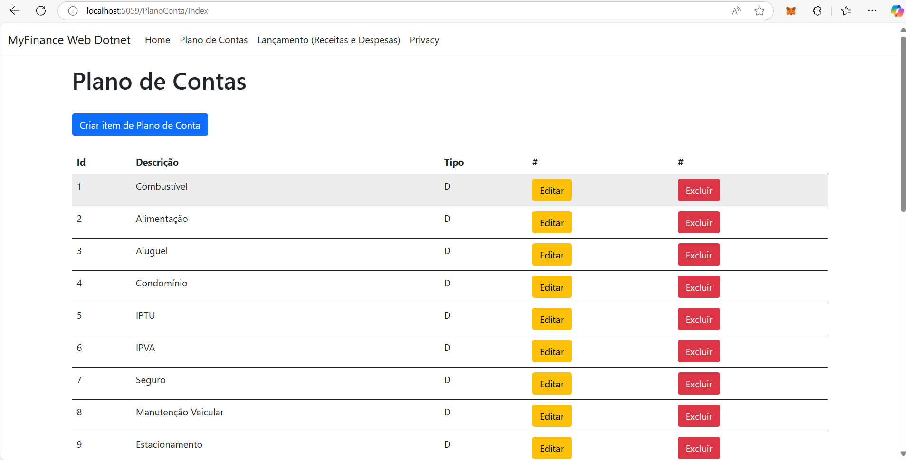
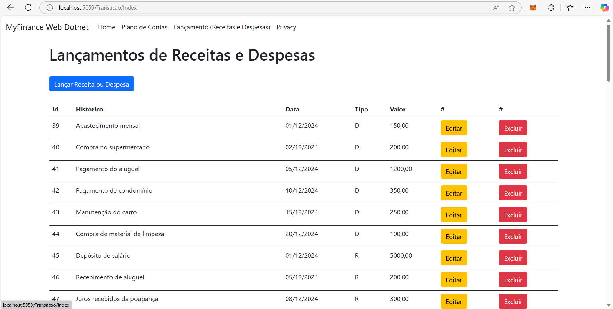
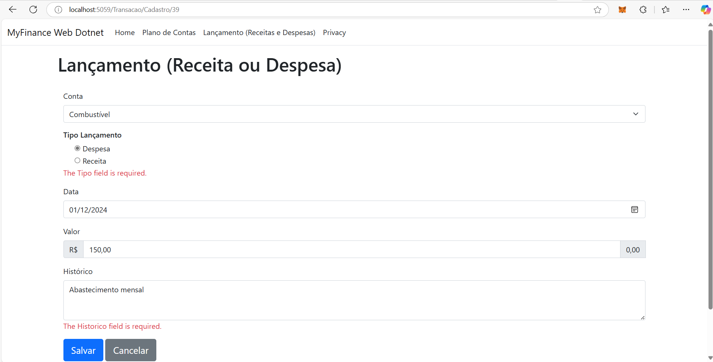

# Sobre o repositório myfinance-web-dotnet
MyFinance Web - Projeto do Curso de Pós-Graduação em Engenharia de Software Online da PUC-MG

Disciplina: **Práticas de Implementação e Evolução de Software**

Professor: **Filipe Tório Lopes Ruas Nhimi**

### Sobre o projeto

Projeto construído para fins didáticos, cuja a proposta é baseada na construção de uma pequena aplicação financeira para uso pessoal. A aplicação foi criada em ASP.NET MVC (Model-View-Controller) com Razor pages, banco de dados Microsoft SQL Server 2022, e Entity Framework Core 9 como framework ORM (Mapeamento de Objeto Relacional).

O Escopo do projeto está descrito no documento [escopo-MyFinanceWeb.pdf](./myfinance-web-dotnet/docs/escopo-MyFinanceWeb.pdf)

Documentos adicionais de definição do projeto:
- Setup de ferramental [setup-tutorial.pdf](./myfinance-web-dotnet/docs/setup-tutorial.pdf)
- Protótipo de telas e sugestão de extensões [prototipo-extensions.pdf](./myfinance-web-dotnet/docs/prototipo-extensions.pdf)

### Ajustes e melhorias

O projeto precisa de algumas melhorias e funcionalidades:

- [x] Reformulação do frontend.
- [x] Inclusão do módulo de login, com gestão de usuários e segregação de perfis.
- [x] Adequação do módulo de dados para enquadramento de contas a pagar e receber, importação de extratos bancários e conciliação bancária.
- [x] Emissão de relatórios
- [x] Notificação de contas vencidas e não pagas, e à vencer.


## 💻 Pré-requisitos

Antes de começar, verifique se você atendeu aos seguintes requisitos:
<!---Estes são apenas requisitos de exemplo. Adicionar, duplicar ou remover conforme necessário--->
* Você instalou a versão mais recente do [VSCode](https://code.visualstudio.com/download)
* Você instalou a versão mais recente do [.NET CORE SDK 8.0](https://dotnet.microsoft.com/en-us/download)
* Você instalou a versão mais recente do [GitHub for `<Windows / Linux / Mac>`](https://desktop.github.com/)
* Você instalou a versão mais recente do [SQL Server 2022 Developer or Express Edition](https://www.microsoft.com/pt-br/sql-server/sql-server-downloads)
* Você instalou a versão mais recente do [SSMS (SQL Server Management Studio)](https://aka.ms/ssmsfullsetup), ou qualquer ferramenta cliente compatível com SQL Server.

## 🚀 Instalando o myfinance-web-dotnet

Para instalar o myfinance-web-dotnet, siga estas etapas:

Windows:
```bash
# Indicar o seu diretório de projetos local, onde deseja armazenar os fontes.
cd {diretório}

# Clonar o repositório
git clone https://github.com/andresantos78/myfinance-web-dotnet.git

# Navegar no repositório
cd myfinance-web-dotnet
```

## ☕ Executando o myfinance-web-dotnet

Para usar myfinance-web-dotnet, siga estas etapas:

Configurando...

```diff
- Altere a senha do usuário SA conforme definnido na instalação do SQL Server
# Arquivo:  myfinance-web-dotnet\Infrastructure\MyFinanceDbContext.cs
# Password=SuaSenha <- Substitua pela senha
+ Server=localhost;Database=myfinance;User Id=sa;Password=SuaSenha;Trusted_Connection=False;TrustServerCertificate=True;Timeout=60;

- Crie o banco de dados myfinance executando o script create-database.sql
# Arquivo:
+ myfinance-web-dotnet\db\scripts\create-database.sql
# O Script acima cria o banco de dados e tabelas utilizadas pelo projeto

- Faça uma carga incial das tabelas utilizadas pelo myfinance
# Arquivos:
+ myfinance-web-dotnet\db\scripts\carga-planoconta.sql
+ myfinance-web-dotnet\db\scripts\carga-transacao.sql

! Caso necessite excluir ou reconstruir o banco de dados myfinance, execute o script drop-datase.sql
# Arquivos:
+ myfinance-web-dotnet\db\scripts\drop-database.sql
# Certifique-se de que não existam conexões ativas com banco de dados myfinance antes de executar esse script.

```

Executando...

```bash
# No diretório onde clonou o repositório entre na pasta myfinance-web-dotnet.
cd myfinance-web-dotnet

# Restaurando dependências
dotnet restore

# Rodando o projeto via CLI do dotnet 
dotnet run

# Caso deseje rodar o projeto em modo live reload, utilize o comando baixo.
dotnet watch run
```

Resultado esperado....

```bash
E:\Estudo\pucminas\projetos\myfinance-web-dotnet\myfinance-web-dotnet>dotnet restore
  Determinando os projetos a serem restaurados...
  Todos os projetos estão atualizados para restauração.

E:\Estudo\pucminas\projetos\myfinance-web-dotnet\myfinance-web-dotnet>dotnet run
Compilando...
info: Microsoft.Hosting.Lifetime[14]
      Now listening on: http://localhost:5059
info: Microsoft.Hosting.Lifetime[0]
      Application started. Press Ctrl+C to shut down.
info: Microsoft.Hosting.Lifetime[0]
      Hosting environment: Development
info: Microsoft.Hosting.Lifetime[0]
      Content root path: E:\Estudo\pucminas\projetos\myfinance-web-dotnet\myfinance-web-dotnet
```

### Evidências das funcionalidades construídas 





